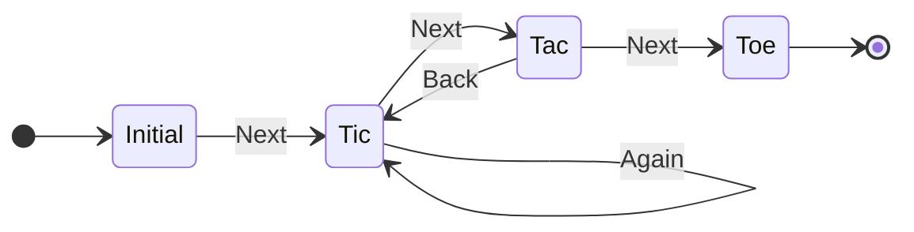

# simple-state-machine

A minimal state machine.

## StateMachine (default export)

The default export is a function (`StateMachine`) that is to be called with an object defining the State Model (as defined below). It will return an object containg two methods:

- `triggerEvent` - Facilitates the transition from the current STATE to a new STATE depending on the TRIGGER being fired.
- `currentState` - returns the current state and is expected to be used for diagnostic purposes.

### triggerEvent method

The `triggerEvent` function is called with one or two arguments. The first parameter is mandatory as specifies the TRIGGER to be used to effect the transition.

The optional second parameter (`payload`) is a dataset that is passed to the ACTION of the target STATE when it is called.

## State Model

The states and triggers that comprise the model are defined in an object as follows:

```JS
{
  STATE_NAME: {
    action: (payload) => {},
    triggers: {
      TRIGGER_NAME: STATE_NAME,
      :
    },
  },
  :
}
```

At the top-level of the model is a list of STATES, one for each property at the top of the object. By default the first STATE is assumed to be the initial state but no ACTION will be executed. Each STATE is an object with two properties: ACTION and TRIGGERS. The ACTION is a function that is executed as the state is adopted as current. TRIGGERS is an object containing a key-value pair for each potential state transition. The key is the name of the TRIGGER of the transition, the value is the target STATE of the transition.

This simple state machine does not support the following features:

- ACTION_TYPES (ENTRY, EXIT or BOTH)
  - ENTRY: fires when the STATE is adopted only
  - EXIT: fired when the STATE is being unadopted only
  - EVERY: fired when the STATE is being adopted or unadopted.
- History and Back support recording of transitions and a mechanism for reversing them.
- Conditional triggers with context
  - Provised and alternative to a stright transisiton to perform a predicate operation on a given context to determine if the transition is to be performed.

---

### Test State Model



### Test data

```js
{
  initial: {
    action: payload => `initial::Payload: "${payload}"`,
    triggers: {
      next: 'tic',
    },
  },
  tic: {
    action: payload => `tic::Payload: "${payload}"`,
    triggers: {
      next: 'tac',
      again: 'tic',
    },
  },
  tac: {
    action: payload => `tac::Payload: "${payload}"`,
    triggers: {
      next: 'toe',
      back: 'tic',
    },
  },
  toe: {
    action: payload => `toe::Payload: "${payload}"`,
    triggers: {},
  },
}
```

---
